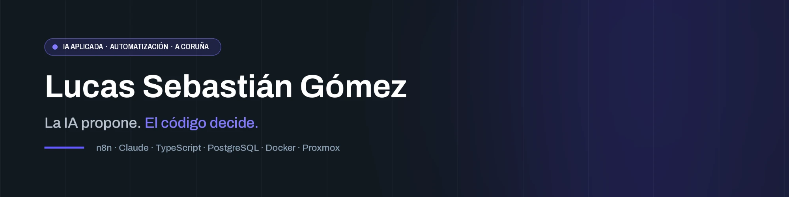

  

Aplico la IA a negocios reales: automatizo el trabajo repetitivo de las empresas para que la gente dedique su tiempo a lo que importa. Soy director de informática en una asesoría de A Coruña y cofundador de [circo estudio](https://circoestudio.com). Vengo de más de 15 años de diseño y código, así que no solo conecto herramientas: construyo la solución entera.

## Lo que hago

- **IA aplicada a problemas concretos.** Valorar contactos comerciales, redactar primeras respuestas, generar contenido que se revisa antes de publicarse. La IA entra donde ahorra horas, no donde queda bonita en una demo.
- **Automatización con n8n.** Flujos que pasan datos entre programas, avisan cuando algo falla y funcionan sin que nadie los vigile.
- **Aplicaciones a medida.** Control horario, portales de proveedores y mesas de ayuda, hechos en TypeScript y PostgreSQL.
- **Infraestructura propia.** Servidores con Proxmox y Docker que monto y administro yo, con los datos bajo control y sin depender de un SaaS para cada cosa.

## Cómo trabajo con IA

Programo y administro servidores con Claude Code. Estas son las reglas que repito en todos los proyectos:

- **Documentación antes del código.** Visión, modelo de datos, reglas de negocio y criterios de aceptación escritos antes de empezar. En el proyecto más grande, el registro de decisiones supera las 60 entradas, cada una con su porqué.
- **Reglas escritas para el asistente.** Cada proyecto y cada servidor tiene un fichero de reglas que el asistente lee en cada sesión: qué puede tocar, qué no y cómo se prueba.
- **Pasos pequeños con pruebas.** Un paso no está hecho hasta que pasan lint, tipos y pruebas. Los despliegues tienen vuelta atrás.
- **Revisión humana.** El asistente propone y ejecuta, pero publicar o desplegar pasa por mí.
- **Seguridad por defecto.** Acceso mínimo: lectura por defecto y permisos de escritura temporales y acotados a cada tarea. Secretos en credenciales, nunca en el código. Y nada se publica sin pasar gitleaks.

## Proyectos

- **[Datafaro](https://github.com/lucassebastiang/datafaro)**: plataforma para agencias de marketing que audita webs y cuentas de publicidad, y aplica correcciones propuestas por IA con aprobación, verificación y vuelta atrás.
- **[blog-automatico-ia](https://github.com/lucassebastiang/blog-automatico-ia)**: el blog y las redes de circo estudio en piloto automático con n8n. Tiene cola de temas, artículos generados y validados, imagen con respaldo y publicación en el blog, Facebook e Instagram.
- **[circoestudio-web](https://github.com/lucassebastiang/circoestudio-web)**: la web de circo estudio sin WordPress. Páginas estáticas que regenera un panel propio, formulario con captcha y antispam, 2FA en el panel y en el portal de clientes, y el blog conectado a n8n.
- **Sistema de leads con IA**: los contactos llegan por varios canales, Claude los analiza y valora, y salen avisos por email y WhatsApp, recordatorios e informes. *Caso de estudio en preparación.*
- **Jornada**: control horario, turnos y bolsa de horas para un grupo de residencias, con fichaje en tablet que funciona sin conexión. *Caso de estudio en preparación.*
- **Infraestructura autohospedada**: Proxmox, contenedores LXC, Docker, copias cifradas fuera del servidor y alertas probadas. *Caso de estudio en preparación.*
- **Portal de proveedores**: homologación por niveles de riesgo, documentación, facturas y firmas para un grupo de residencias. *Caso de estudio en preparación.*

## Stack

TypeScript · Node.js · Next.js · Fastify · PostgreSQL · n8n · Docker · Proxmox · Claude Code · Claude API

## Contacto

- LinkedIn: [lucassebastiangomez](https://www.linkedin.com/in/lucassebastiangomez/)
- Web: [circoestudio.com](https://circoestudio.com)
